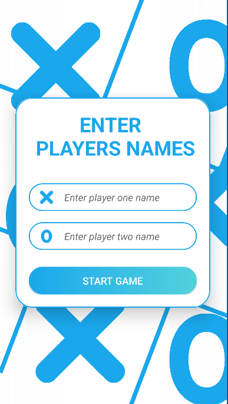
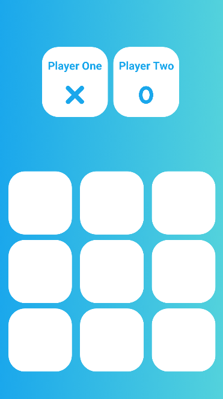
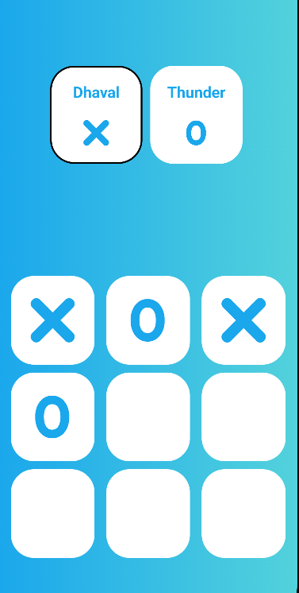
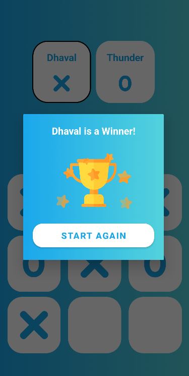

# Android TicTacToe Game

A simple TicTacToe game for Android built using Java and Android Studio. Play against a friend or challenge the computer. Includes a clean user interface and responsive gameplay.

## Screenshots

<table>
  <tr>
    <td></td>
    <td></td>
  </tr>
  <tr>
    <td></td>
    <td></td>
  </tr>
</table>

## Technologies/Libraries Used

- Java
- Android Studio
- XML for layout design

## How to Play

- Tap on a cell to place your X or O.
- The first player to get three of their marks in a row (horizontally, vertically, or diagonally) wins.
- If all cells are filled and no player has won, the game is a draw.

## Build/Run Instructions

1. Clone the repository.
2. Open the project in Android Studio.
3. Run the app on an Android emulator or physical device.

## Contributing Guidelines

- Report any issues using the GitHub issue tracker.
- Feel free to fork the repository and submit pull requests for new features or bug fixes.

## License

This project is licensed under the MIT License - see the [LICENSE.md](LICENSE.md) file for details.

## Contact

For questions or feedback, contact Dhaval Chhayla at dhavalhchhayla@gmail.com.
